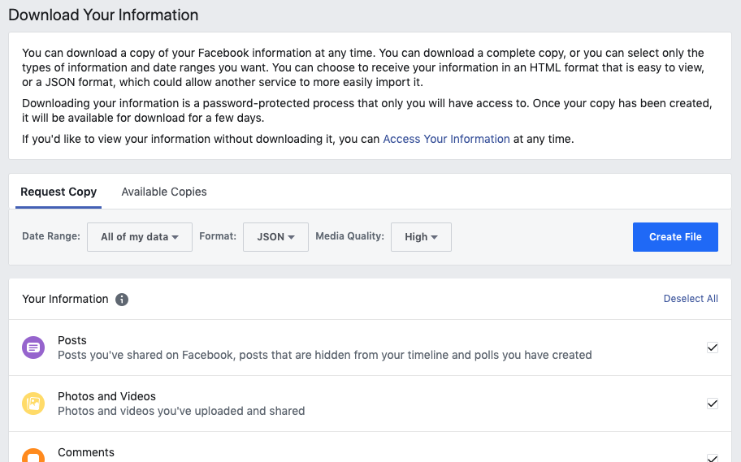
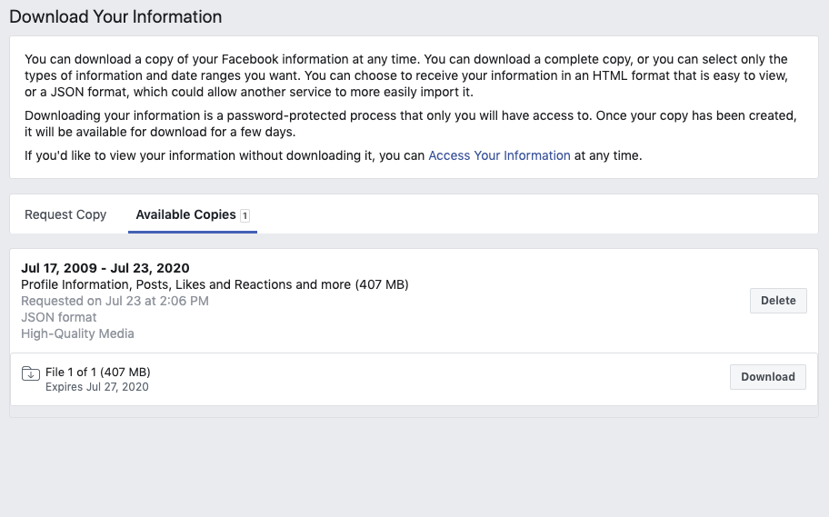
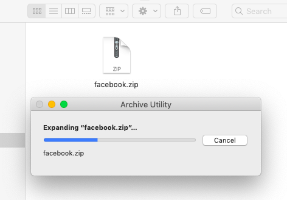
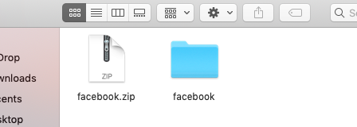

# fb-unarchive #

## Instructions (MacOS) ##

  1. Request a copy of your data (JSON formatted) from Facebook:  
    
  2. Download the archive from Facebook:  
    
  3. Extract the archive:  
    
    
  4. Download and extract the latest release of `fb-unarchive` from the [releases page](https://github.com/crawford/fb-unarchive/releases). Look for the asset ending in "apple-darwin.tar.gz".
  5. Open the Terminal app and run the following commands to change the current directory to that of the archive ("Downloads/facebook" in this case; yours may have a different name) and run `fb-unarchive` to actually unpack the archive:
     ```sh
     cd Downloads/facebook
     fb-unarchive -v
     ```
By default, `fb-unarchive` writes the results to a directory named "out" in the current one. The albums are arranged into directories matching their name and the photos and videos within them have their metadata updated to match that which was found in the archive.
